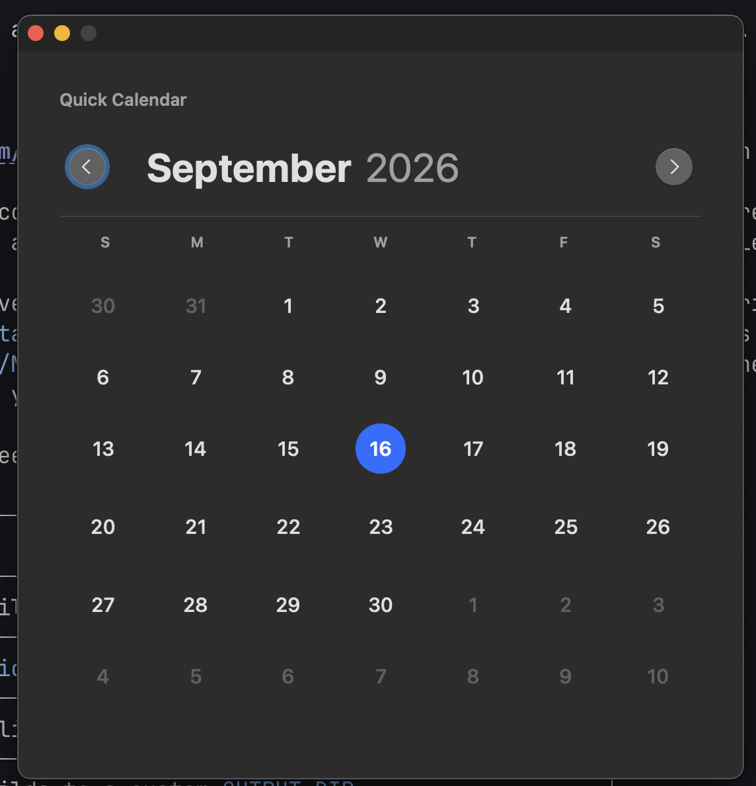
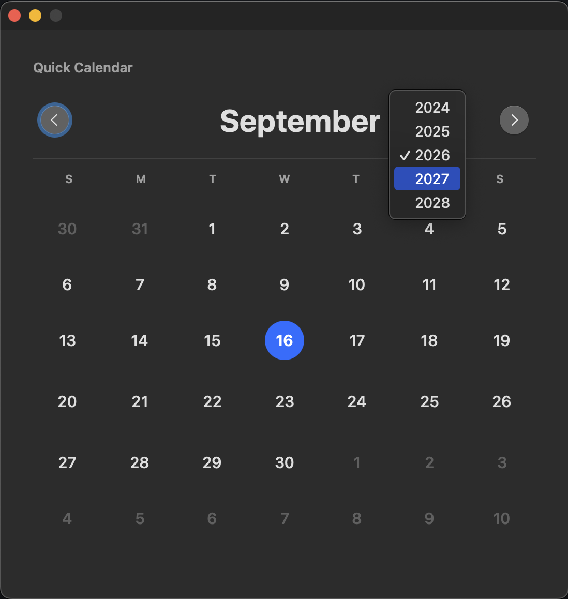

# Quick Calendar

[](https://github.com/ijidak/QuickCalendar/actions/workflows/build.yml)

Quick Calendar is a small native macOS month-view calendar written in Swift and AppKit. It opens on the current month, highlights today, supports previous/next-month navigation, lets you select a year within two years of the current year, and quits after 30 seconds without mouse or keyboard activity.

## Screenshots

| Month view | Year picker |
| --- | --- |
|  |  |

## Download

Prebuilt Apple Silicon builds are attached to each [release](https://github.com/ijidak/QuickCalendar/releases). Download the `.dmg`, open it, and drag **Quick Calendar** to your Applications folder.

**On first launch, right-click the app and choose Open**, then confirm. A double-click will fail.

Releases are ad-hoc signed and are not notarized by Apple, so Gatekeeper blocks them until you approve the app once; the right-click is that approval. If macOS still refuses to open it:

```sh
xattr -dr com.apple.quarantine "/Applications/Quick Calendar.app"
```

To build from source instead, see [Build](#build) below.

## System requirements

- Apple Silicon Mac
- macOS 13 Ventura or later
- Xcode Command Line Tools with Swift installed

Install the command-line tools if needed:

```sh
xcode-select --install
```

The build has no third-party dependencies and does not require a full Xcode installation.

## Build

From Terminal, change to this source directory and run:

```sh
chmod +x build.sh
./build.sh
```

The finished disk image is written to:

```text
dist/Quick Calendar.dmg
```

You can override the output directory:

```sh
OUTPUT_DIR=/path/to/output ./build.sh
```

The script locates the macOS SDK with `xcrun --show-sdk-path --sdk macosx`. Override it if you need to build against a specific SDK:

```sh
SDK_PATH=/path/to/MacOSX.sdk ./build.sh
```

The script performs these steps:

1. Compiles `Sources/main.swift` as a native AppKit executable.
2. Builds the `.app` bundle and copies `Info.plist`.
3. Generates the calendar icon and packages it as `AppIcon.icns`.
4. Applies an ad-hoc code signature.
5. Creates a compressed DMG. If the macOS disk-image service cannot create that format, it falls back to an HFS hybrid DMG; if that also fails, it produces `Quick Calendar.zip`.

## Test

After building, run the non-UI calendar self-tests:

```sh
"build/Quick Calendar.app/Contents/MacOS/QuickCalendar" --self-test
```

Verify the app bundle signature:

```sh
codesign --verify --deep --strict --verbose=2 "build/Quick Calendar.app"
```

For a manual test, mount the DMG and open **Quick Calendar**. Check that:

- The current month appears and today is highlighted.
- The left and right buttons move one month backward and forward.
- Clicking the year shows years from two years before through two years after the current year.
- The app closes after 30 seconds without mouse or keyboard input.

## Source layout

```text
QuickCalendar/
├── Sources/
│   ├── main.swift       App UI, calendar logic, and inactivity timer
│   ├── IconMaker.swift  Generates the source calendar icon PNG
│   └── ICNSMaker.swift  Packages icon PNGs into the macOS ICNS format
├── .github/workflows/   CI build and tagged-release automation
├── Info.plist           macOS application bundle metadata
├── screenshots/         README screenshots
├── build.sh             Complete reproducible build and packaging script
├── LICENSE              MIT license
└── README.md
```

## Signing and distribution

`build.sh` uses an ad-hoc signature so the app can run locally without a developer certificate. It is not notarized by Apple, and CI releases inherit the same ad-hoc signature, which is why downloaded builds need the one-time approval described under [Download](#download).

To distribute without any Gatekeeper warning, join the Apple Developer Program, replace the ad-hoc signing step with a Developer ID Application signature, and notarize the package through Apple.

## Releasing

Pushes to `main` build the app, run the self-tests, verify the signature, and upload the package as a workflow artifact. No release is published.

To publish a release, push a `v*` tag:

```sh
git tag v1.1.0
git push origin v1.1.0
```

That builds from the tag, stamps `CFBundleShortVersionString` with the tag version, and creates a GitHub Release with `QuickCalendar-1.1.0.dmg` attached.

## License

Released under the [MIT License](LICENSE).
